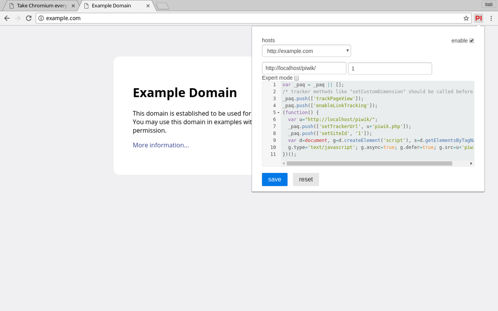

Piwik Browser Injector
========

Piwik Browser Injector helps you to try out [Piwik](https://piwik.org/), the leading open source web analytics software, in cases where it isn't possible to modify the source of a website or when you just want to quickly see how the visitor data of your website would look like in Piwik.

### Usage:
* open the domain, where you want to include the tracking code localy
* click on the Piwik Browser Injector icon in your toolbar and enter the URL to your piwik instance and the ID of your website
* if you want to try out advanced features you can enable the expert mode where you can freely modify the tracking code

This extention is in an early development state and may include backward-incompatible changes in future versions.

If you notice any bugs or have wishes for features open an issue on the github repository:
https://github.com/Findus23/piwik-injector

Licended under [the MIT License](https://github.com/Findus23/piwik-injector/blob/master/LICENSE) and based on the work of [hromadadan](https://github.com/guzart/customjs) and [xcv58](https://github.com/xcv58/Custom-JavaScript-for-Websites-2)

